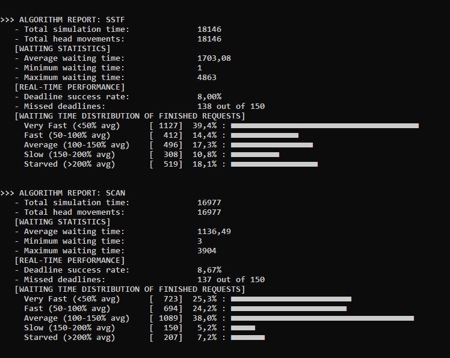

# Disk Scheduling Algorithms Simulator

>Java simulator for comparing the efficiency of disk head scheduling algorithms.

## Overview

This project was created as part of an Operating Systems course. It simulates and compares classic disk head scheduling algorithms to analyze head movement, total seek time, and efficiency.

Algorithms simulated in this project:
- **FCFS**
- **SSTF**
- **SCAN**
- **C_SCAN**
- **EDF**
- **FD_SCAN**

## Preview



## How to Run
1. Download `.zip` file and extract all files
2. Open terminal and navigate to `src` directory in project:
   ```cmd
   cd path/.../src
   ```
   or open cmd or terminal in project's `src` directory.

3. Compile all Java files from packages to `bin` directory:
   ```cmd
   javac -d bin main/*.java tools/*.java
   ```

4. Run the application:
   ```cmd
   java -cp bin main.Main
   ```

*(Alternatively, you can open the project in any Java IDE like IntelliJ IDEA and run `Main.java` directly.)*

## Configuration

You can easily adjust simulation parameters to test different workloads:

1. Open `main/Settings.java` in text editor. There you can read about values you want to change. There are also common settings as example - changing them does nothing.
2. Open `main/Main.java` in text editor. There you can change values in 3 different setups. You can also choose to run specific algorithms by deleting other ones from `testAllAlgorithms` function.
3. Save the file and recompile the project before running again.

## License

This project is licensed under the MIT License - feel free to use and adapt it for learning purposes.
